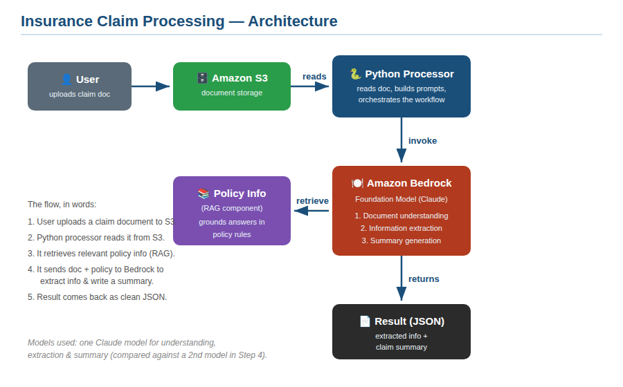

# 🏥 Insurance Claim Document Processor

An AI-powered application that automates insurance claim processing using **Amazon Bedrock**.
Upload a claim document to **Amazon S3**, and the app extracts key information, grounds its
assessment in policy rules using **Retrieval Augmented Generation (RAG)**, and generates a
claims-adjuster-ready summary.

> Built as a hands-on project while preparing for the **AWS Certified Generative AI Developer – Professional** certification. #awsexamprep

---

## ✨ What it does

Given an insurance claim document, the app:

1. **Reads** the document from Amazon S3
2. **Extracts** structured info (claimant, policy number, incident date, amount, description) as clean JSON
3. **Validates** the extracted data (checks the JSON is well-formed and complete)
4. **Retrieves** relevant policy rules using a simple RAG component
5. **Assesses coverage** — grounded in the retrieved policy info (deductible, limits, requirements)
6. **Generates** a concise summary
7. Can **compare** two foundation models on speed and accuracy

### Example output

```json
{
  "extracted_info": {
    "claimant_name": "Maria Gonzalez",
    "policy_number": "AUTO-2024-889321",
    "claim_amount": "$4,850.00"
  },
  "retrieved_policies": ["AUTO-COLLISION", "CLAIMS-GENERAL"],
  "coverage_assessment": "This claim appears covered under Auto Collision Coverage.
    The policyholder is responsible for the $500 deductible, with coverage up to
    $50,000. Since the claim exceeds $2,000, a police report is required..."
}
```

Notice the coverage assessment cites the **$500 deductible** and **$2,000 police-report rule** —
facts pulled from the policy data via RAG, not invented by the model.

---

## 🏛️ Architecture



**Flow:** User → S3 (storage) → Python processor → retrieves policy info (RAG) → Amazon Bedrock (extract, assess, summarize) → JSON result.

---

## 🤖 Model selection & findings

| Job | Approach |
|-----|----------|
| **Document understanding & extraction** | Claude Haiku, `temperature = 0` (precise, repeatable) |
| **Coverage assessment** | Claude Haiku, `temperature = 0.3` (grounded in retrieved policy) |
| **Summary generation** | Claude Haiku, `temperature = 0.5` (natural phrasing) |

**Model comparison (Haiku vs Sonnet):**

| Model | Time | Accuracy | Valid JSON |
|-------|------|----------|------------|
| Claude Haiku 4.5 | **0.99s** | ✅ 100% | ✅ |
| Claude Sonnet 4.5 | 2.08s | ✅ 100% | ✅ |

**Recommendation:** Use **Claude Haiku** for this workload. Claim-field extraction is a structured
task that does not require Sonnet's additional reasoning power — Haiku delivers identical accuracy
at ~2× the speed and a fraction of the cost. This demonstrates the principle of **right-sizing the
model** to the task. Reserve Sonnet for ambiguous documents or complex reasoning.

---

## 🧩 How RAG works here

This project uses a **simple RAG component** (keyword-based retrieval) to keep it lightweight:

```
Claim text → retrieve relevant policies (keyword match) → inject into prompt → model assesses coverage
```

In a **production system**, the retrieval step would use **embeddings + vector similarity search**
(e.g. Amazon OpenSearch, or Amazon Bedrock Knowledge Bases). The *pattern* is identical —
retrieve → augment → generate — only the retrieval mechanism changes from keyword matching to
semantic vector search. This project deliberately shows the pattern clearly before adding that layer.

---

## 📁 Project structure

```
claim-processor/
├── README.md
├── architecture.png
├── requirements.txt
├── cleanup.sh                 ← deletes AWS resources when done
├── src/
│   ├── config.py              ← settings (models, region, bucket)
│   ├── prompt_manager.py      ← reusable prompt templates
│   ├── model_invoker.py       ← reusable Bedrock (Converse API) caller
│   ├── validator.py           ← cleans & validates model output
│   ├── rag.py                 ← simple policy retrieval (RAG)
│   ├── processor.py           ← main workflow
│   └── compare_models.py      ← model comparison test
├── policy_docs/
│   └── policies.json          ← policy "knowledge base" for RAG
└── sample_documents/
    └── claim1.txt             ← example claim to test with
```

---

## 🚀 Setup & usage (Amazon CloudShell or local)

```bash
# 1. Create an S3 bucket (must be globally unique, lowercase)
aws s3 mb s3://claim-documents-poc-<your-initials>

# 2. Update the bucket name in src/config.py

# 3. Install dependencies
pip install -r requirements.txt

# 4. Upload a sample document
aws s3 cp sample_documents/claim1.txt s3://claim-documents-poc-<your-initials>/claims/claim1.txt

# 5. Run the processor
cd src
python3 processor.py

# 6. (Optional) Compare models
python3 compare_models.py
```

> **Note on model IDs:** newer Bedrock models require a cross-region **inference profile ID**
> (prefixed with `us.`). List what's available to you with:
> `aws bedrock list-inference-profiles --region us-east-1`

---

## 🛠️ Tech stack & concepts

- **Amazon Bedrock** (Converse API) — foundation model inference
- **Anthropic Claude** (Haiku & Sonnet) — the models
- **Amazon S3** — document storage
- **Python + boto3** — application code
- **RAG** — grounding responses in policy data
- Concepts: prompt management, output validation, model right-sizing, inference profiles

---

## 💰 Cost & cleanup

This project uses paid AWS services (usage for this PoC is minimal — cents). When finished:

```bash
bash cleanup.sh   # empties and deletes the S3 bucket
```

Set a billing alert (\$5–10) before running, and clean up when done.

---

## 📚 What I learned

- How to integrate Amazon Bedrock using the modern **Converse API**
- Building a **RAG pattern** from scratch and understanding where vector search fits
- Handling real AWS issues: retired models, model lifecycle, **inference profiles**
- **Right-sizing models** — proving with data that the cheaper model was sufficient
- Structuring GenAI code into **reusable, standardized components**

---

*This project is for educational purposes. Built during AWS certification prep.*
